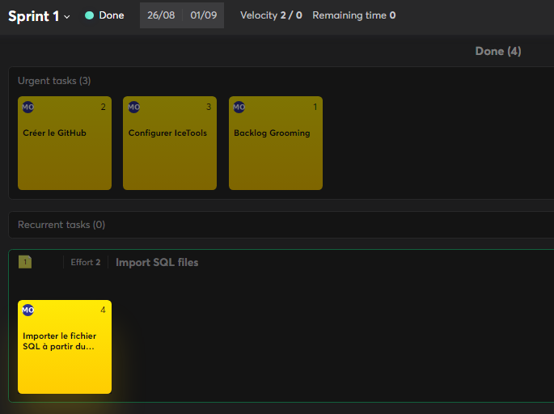

# Mathis Olaya - MP2C - MID2A . GRP2C - 2024/2025 

## Remarques 

### DB
- Le journal de travail du Sprint 1 n'existe pas car j'ai oublié d'attribuer un temps à chaque tâches, ce qui fait que je ne peux pas l'exporter en utilisant IceTools. Cependant les tâches existent quand mêmes.
  
- Le journal de travail du Sprint 4 est vide car nous n'avions pas cours ce jour-là en raison du Lundi du Jeûne Fédéral.
